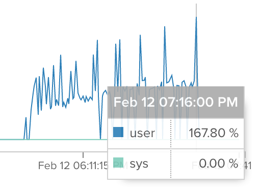

<iframe src="https://ghbtns.com/github-btn.html?user=holyxiaoxin&amp;repo=async-tasks-benchmark&amp;type=watch&amp;count=true&amp;size=large"
  allowtransparency="true" frameborder="0" scrolling="0" width="170" height="30"></iframe> 

EATBenchmark explores the execution time between **synchronous** and **asynchronous** HTTP request jobs. (5 mins read)

---

I needed a way to handle multiple HTTP requests while not doing so in a blocking manner.
Initially, I was checking out how processes work and was having some fun spawning a ton of them while staring at Erlang's observe GUI.
Then I went on to take a look at how [Elixir Task](http://elixir-lang.org/docs/v1.1/elixir/Task.html) would help me in achieving similar results in an abstracted manner.

And so I tried writing some code.

~~~ elixir
urls
  |> Enum.map(&Task.async(fn -> HTTPoison.get(&1) end))
  |> Enum.map(&Task.await(&1, 30000))
~~~

We start a task for each of the HTTP requests and then wait on it.

Quoting from Michał Muskała's [post](http://michal.muskala.eu/2015/08/06/parallel-downloads-in-elixir.html):

>The reason why we are using `map` as compared to `stream`,
>is because `stream` is lazy, and starts processing the next element
>only after the current one passed through the whole pipeline.
>It would make tasks go one, by one through our `Task.async` and `Task.await` turning them sequential!
>The exact opposite of what we’re trying to achieve.

To test that this actually works as expected, I tried comparing it with a batch of synchronous http requests.

~~~ elixir
urls
  |> Enum.map(&HTTPoison.get(&1))
~~~

Borrowing Erlang's timer module `:timer.tc fn -> end`, we could easily get how long each batch of requests took.

The results at this point of time revealed that both code took around the same time to execute, even for a large amount of HTTP requests.
This is due to Hackney's default connection pool of 50. We could easily increase it by defining the pool to a much larger size

~~~ elixir
  :ok = :hackney_pool.start_pool(
    :first_pool,
    [timeout: 15000, max_connections: 1000]
  )
~~~

before we start HTTPoison and its dependencies. More on this [here](https://github.com/edgurgel/httpoison/issues/73).

Another problem with this test is that the first request usually takes a while more to which affects
the result of jobs with smaller number of requests. I tested this by swapping around the order of synchronous and asynchronous jobs.
This might be due to the initial DNS query. So we can just ignore the first `HTTPoison.get(url)`.

With the above corrected, I managed to write a script to time how long the jobs compared to each other:  
`./tasks -u https://noncaching.url -m 60 -l 50`

`-u`: url - provide a non-caching url which a reasonable pool size  
`-m`: multiplier - the length of urls, size of jobs  
`-l`: loop - how many times the same job is tests; results will be more accurate with higher loops

 

## The findings are displayed below:

 

**Loop: 10**

<canvas id="my-chart-1"></canvas>

 

**Loop: 50**

<canvas id="my-chart-2"></canvas>

 

I spun up the servers myself because I didn't want to be accused of DOSing someone's machine.
And requests were indeed intensive for the tiny servers. :P

You can check out the escript [here](https://github.com/holyxiaoxin/async-tasks-benchmark/blob/master/lib/tasks.ex).

<a href="https://github.com/holyxiaoxin/async-tasks-benchmark" class="github-corner"><svg width="80" height="80" viewBox="0 0 250 250" style="fill:#151513; color:#fff; position: absolute; top: 0; border: 0; right: 0;"><path d="M0,0 L115,115 L130,115 L142,142 L250,250 L250,0 Z"></path><path d="M128.3,109.0 C113.8,99.7 119.0,89.6 119.0,89.6 C122.0,82.7 120.5,78.6 120.5,78.6 C119.2,72.0 123.4,76.3 123.4,76.3 C127.3,80.9 125.5,87.3 125.5,87.3 C122.9,97.6 130.6,101.9 134.4,103.2" fill="currentColor" style="transform-origin: 130px 106px;" class="octo-arm"></path><path d="M115.0,115.0 C114.9,115.1 118.7,116.5 119.8,115.4 L133.7,101.6 C136.9,99.2 139.9,98.4 142.2,98.6 C133.8,88.0 127.5,74.4 143.8,58.0 C148.5,53.4 154.0,51.2 159.7,51.0 C160.3,49.4 163.2,43.6 171.4,40.1 C171.4,40.1 176.1,42.5 178.8,56.2 C183.1,58.6 187.2,61.8 190.9,65.4 C194.5,69.0 197.7,73.2 200.1,77.6 C213.8,80.2 216.3,84.9 216.3,84.9 C212.7,93.1 206.9,96.0 205.4,96.6 C205.1,102.4 203.0,107.8 198.3,112.5 C181.9,128.9 168.3,122.5 157.7,114.1 C157.9,116.9 156.7,120.9 152.7,124.9 L141.0,136.5 C139.8,137.7 141.6,141.9 141.8,141.8 Z" fill="currentColor" class="octo-body"></path></svg></a>
